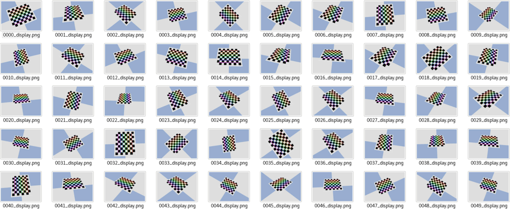
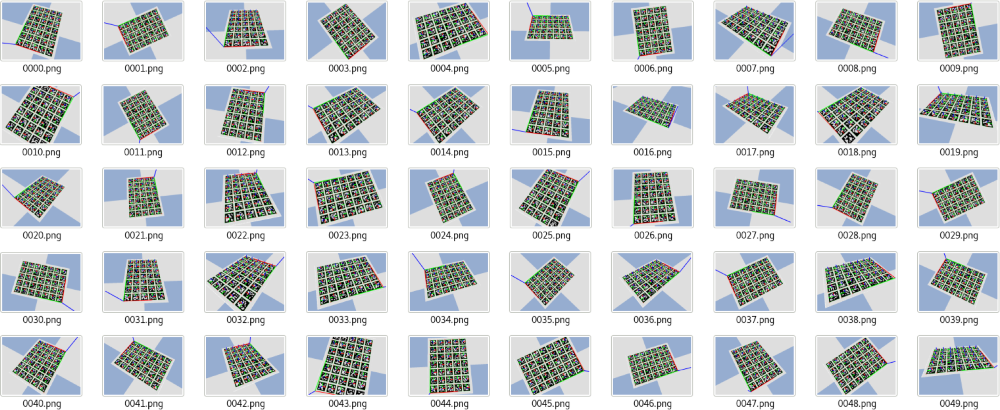

This repository is mainly for camera intrinsic calibration 
and hand-eye calibration. 

Synthetic experiments are conducted in [PyBullet](https://pybullet.org) simulator.

#### 1. Test the accuracy of aruco board
```angular2html
python aruco_sim_test.py
```

#### 2. Calibrate the camera
```angular2html
python chessboard_sim_test.py
```



#### 3. Hand-eye calibration
```angular2html
python hand_eye_calibration_sim_test.py
```


#### Note
1 All .obj files in ```assets``` folder are generated by [CoppeliaSim](https://www.coppeliarobotics.com/).

2 The implementations of aruco detection and camera intrinsic calibration 
are based on [OpenCV](https://opencv.org/).

3 The implementation of hand-eye calibration is based on 
"Hand-Eye Calibration Using Dual Quaternions" by Konstantinos Daniilidis and 
"Robust Hand-Eye Calibration of an Endoscopic Surgery Robot Using Dual Quaternions" by Jochen Schmidt et al.

4 Some useful links are listed below:

[How to decide on which ArUco marker dictionary you want to use?](https://www.pyimagesearch.com/2020/12/14/generating-aruco-markers-with-opencv-and-python/)

[Chessboard Generator](https://eleif.net/checker.html)

[A brief introduction of hand-eye calibration by TUM](http://campar.in.tum.de/Chair/HandEyeCalibration)

